# Tài liệu UML đầy đủ - Hệ thống Thi Trắc Nghiệm

## 0) Phạm vi tài liệu
Tài liệu này mô tả đầy đủ các chức năng theo **backend hiện tại** (FastAPI), gồm các nhóm API:
- `/login`
- `/users`
- `/classes`
- `/questions`
- `/exams`
- `/results`
- `/` (health check)

Lưu ý triển khai hiện tại:
- Đăng nhập trả JWT ở `/login`.
- Nhiều API nghiệp vụ đang xác thực bằng header `x-user-id`.

## 1) Danh sách đầy đủ các use-case

### Nhóm A - Xác thực

#### UC-A1: Đăng nhập hệ thống
- Tác nhân: Admin/Teacher/Student
- API: `POST /login`
- Tiền điều kiện: Có tài khoản hợp lệ
- Kết quả: Nhận `access_token`, `user_id`, `role`, `full_name`

#### UC-A2: Kiểm tra trạng thái API
- Tác nhân: Bất kỳ client
- API: `GET /`
- Kết quả: Nhận thông báo API đang chạy

### Nhóm B - Quản lý người dùng (`/users`)

#### UC-B1: Tạo người dùng
- Tác nhân: Quản trị vận hành (theo nghiệp vụ)
- API: `POST /users`
- Kết quả: Tạo user mới (student/teacher/admin)

#### UC-B2: Xem danh sách người dùng
- API: `GET /users`
- Kết quả: Trả danh sách user (có phân trang `skip`, `limit`)

#### UC-B3: Xem chi tiết người dùng
- API: `GET /users/{user_id}`

#### UC-B4: Cập nhật người dùng
- API: `PUT /users/{user_id}`
- Kết quả: Cập nhật thông tin user, có thể đổi mật khẩu

#### UC-B5: Xóa người dùng
- API: `DELETE /users/{user_id}`

### Nhóm C - Quản lý lớp học (`/classes`)

#### UC-C1: Giáo viên xem danh sách lớp của mình
- API: `GET /classes`

#### UC-C2: Giáo viên tạo lớp
- API: `POST /classes`

#### UC-C3: Giáo viên xem chi tiết lớp
- API: `GET /classes/{class_id}`

#### UC-C4: Giáo viên cập nhật lớp
- API: `PUT /classes/{class_id}`

#### UC-C5: Giáo viên xóa lớp
- API: `DELETE /classes/{class_id}`

#### UC-C6: Giáo viên xem học sinh chưa thuộc lớp
- API: `GET /classes/{class_id}/available-students`

#### UC-C7: Giáo viên thêm học sinh vào lớp
- API: `POST /classes/{class_id}/students/{student_id}`

#### UC-C8: Giáo viên xóa học sinh khỏi lớp
- API: `DELETE /classes/{class_id}/students/{student_id}`

### Nhóm D - Quản lý câu hỏi (`/questions`)

#### UC-D1: Tạo câu hỏi
- API: `POST /questions`

#### UC-D2: Xem danh sách câu hỏi
- API: `GET /questions`

#### UC-D3: Xem chi tiết câu hỏi
- API: `GET /questions/{question_id}`

#### UC-D4: Cập nhật câu hỏi
- API: `PUT /questions/{question_id}`

#### UC-D5: Xóa câu hỏi
- API: `DELETE /questions/{question_id}`

### Nhóm E - Quản lý đề thi (`/exams`)

#### UC-E1: Giáo viên xem đề thi của mình
- API: `GET /exams`

#### UC-E2: Giáo viên tạo đề thi
- API: `POST /exams`
- Bao gồm: thông tin đề, danh sách lớp được phép (`class_ids`), danh sách câu hỏi (`questions`)

#### UC-E3: Học sinh xem các đề của mình
- API: `GET /exams/my-exams`

#### UC-E4: Xem chi tiết đề thi
- API: `GET /exams/{exam_id}`
- Có kiểm tra quyền truy cập đề

#### UC-E5: Cập nhật đề thi
- API: `PUT /exams/{exam_id}`
- Có kiểm tra quyền và cập nhật lớp/câu hỏi

#### UC-E6: Xóa đề thi
- API: `DELETE /exams/{exam_id}`

#### UC-E7: Xem danh sách câu hỏi trong đề
- API: `GET /exams/{exam_id}/questions`

#### UC-E8: Kiểm tra mật khẩu đề thi
- API: `POST /exams/{exam_id}/check-password`

### Nhóm F - Kết quả thi (`/results`)

#### UC-F1: Học sinh nộp bài thi
- API: `POST /results/submit/{exam_id}`
- Hệ thống chấm tự động, lưu `exam_result` và `exam_result_detail`

#### UC-F2: Xem một kết quả thi
- API: `GET /results/{result_id}`

#### UC-F3: Xem lịch sử thi của học sinh
- API: `GET /results/student/{student_id}`

#### UC-F4: Giáo viên xem kết quả theo đề
- API: `GET /results/exam/{exam_id}`

#### UC-F5: Review bài làm
- API: `GET /results/{result_id}/review`
- Student chỉ xem bài của mình và khi đề cho phép `allow_view_answers`
- Teacher chỉ xem bài thuộc đề do mình tạo

#### UC-F6: Cập nhật điểm thủ công
- API: `PUT /results/{result_id}/score`

#### UC-F7: Xóa kết quả thi
- API: `DELETE /results/{result_id}`

## 2) Mô hình Use-case tổng quan

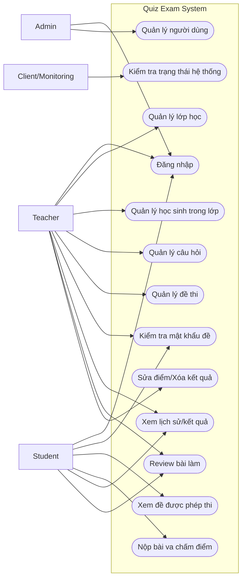

## 3) Mô hình Use-case chi tiết theo phân hệ

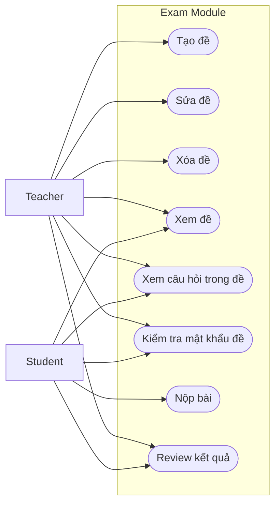

## 4) Biểu đồ luồng dữ liệu (DFD)

### 4.1 DFD mức ngữ cảnh (Context Diagram)

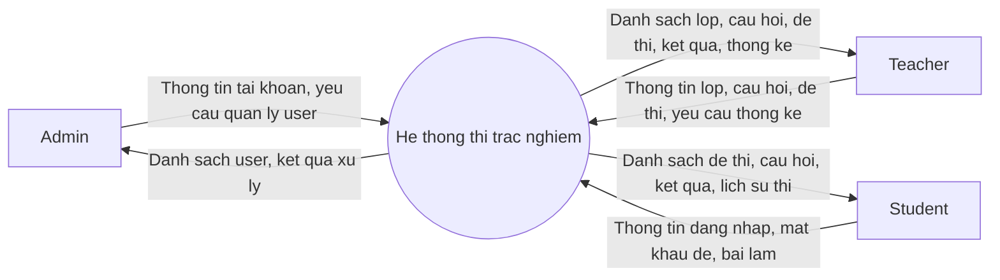

### 4.2 DFD mức 0

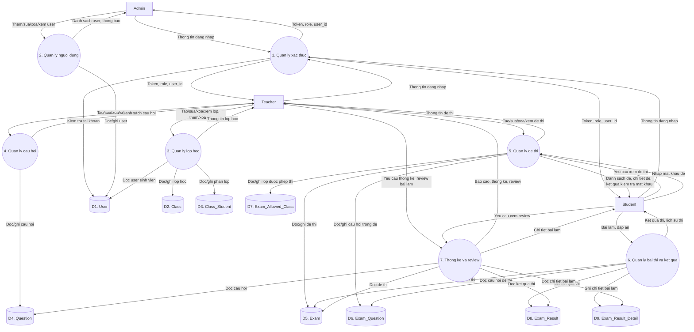

### 4.3 DFD mức 1 cho phân hệ làm bài thi

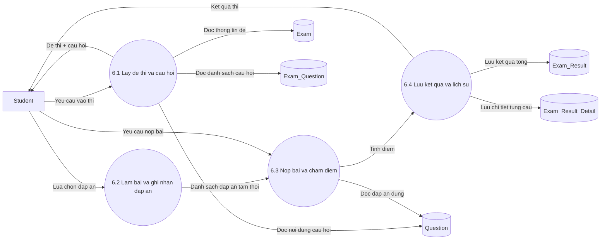

### 4.4 DFD mức 1 cho phân hệ thống kê và review

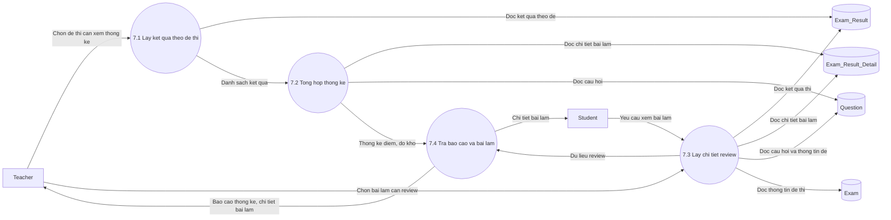

## 5) Mô hình lớp (Class Diagram)

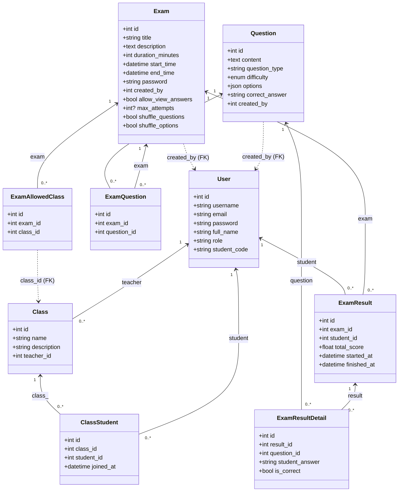

### 5.1 Class Diagram theo hướng thiết kế có methods

Lưu ý: sơ đồ dưới đây là bản phục vụ báo cáo phân tích thiết kế hướng đối tượng, nên có bổ sung các thao tác nghiệp vụ chính. Nó không nhằm phản ánh 1:1 các method đang nằm trong file model Python.

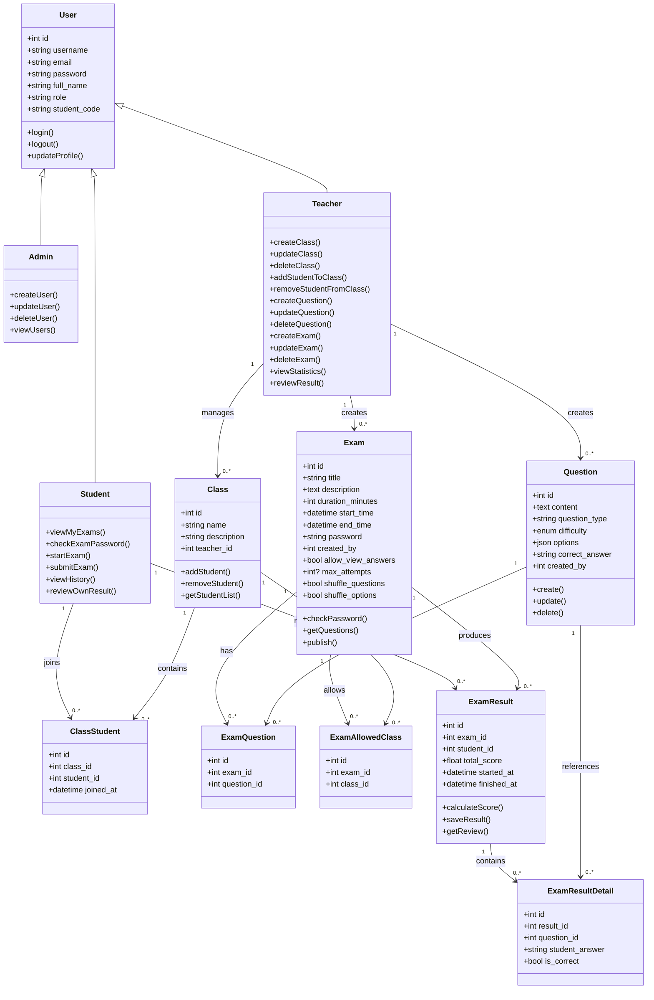

## 6) Mô hình đối tượng (Object Snapshot)

- `admin_1:User {id=1, role="admin"}`
- `teacher_5:User {id=5, role="teacher"}`
- `student_12:User {id=12, role="student", student_code="SE1201"}`
- `class_3:Class {id=3, name="SE401", teacher_id=5}`
- `class_student_1:ClassStudent {class_id=3, student_id=12}`
- `question_101:Question {id=101, difficulty="MEDIUM"}`
- `exam_10:Exam {id=10, created_by=5, max_attempts=1, allow_view_answers=true}`
- `exam_question_1:ExamQuestion {exam_id=10, question_id=101}`
- `allow_class_1:ExamAllowedClass {exam_id=10, class_id=3}`
- `result_55:ExamResult {exam_id=10, student_id=12, total_score=8.0}`
- `result_detail_1:ExamResultDetail {result_id=55, question_id=101, is_correct=true}`

## 7) Các biểu đồ tuần tự theo giao diện hiện tại

Lưu ý: phần này chỉ giữ các luồng đang có màn hình ở frontend hiện tại. Các API backend chưa có màn hình riêng như `sửa điểm` hoặc `xóa kết quả` không đưa vào đây.

### SD-01: Đăng nhập và điều hướng theo vai trò
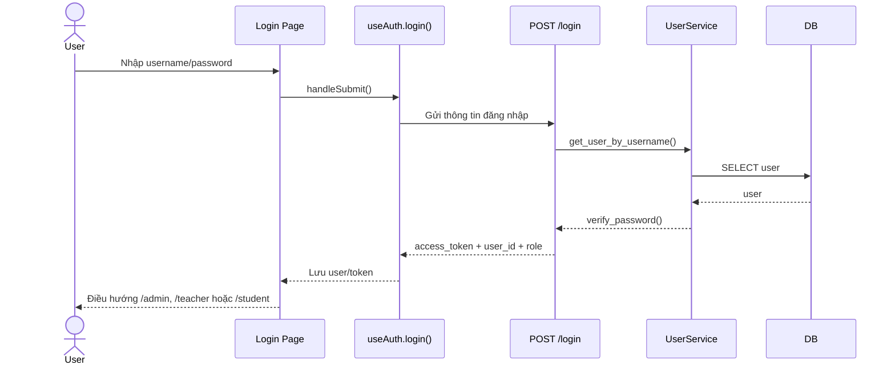

### SD-02: Admin quản lý tài khoản người dùng
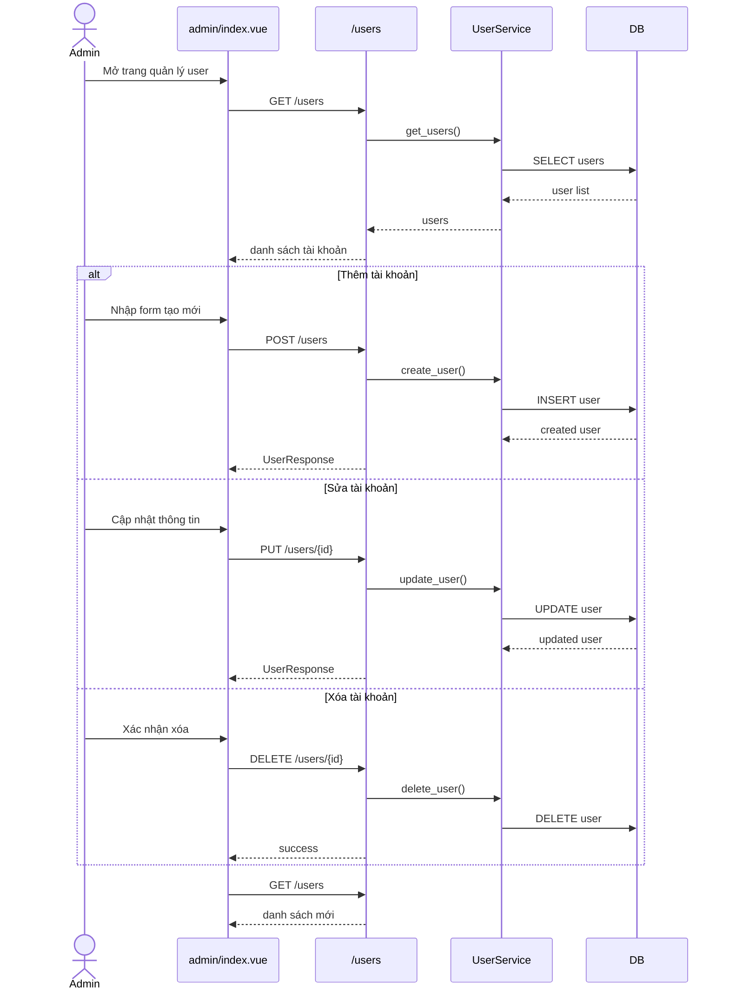

### SD-03: Teacher quản lý lớp học và sinh viên trong lớp
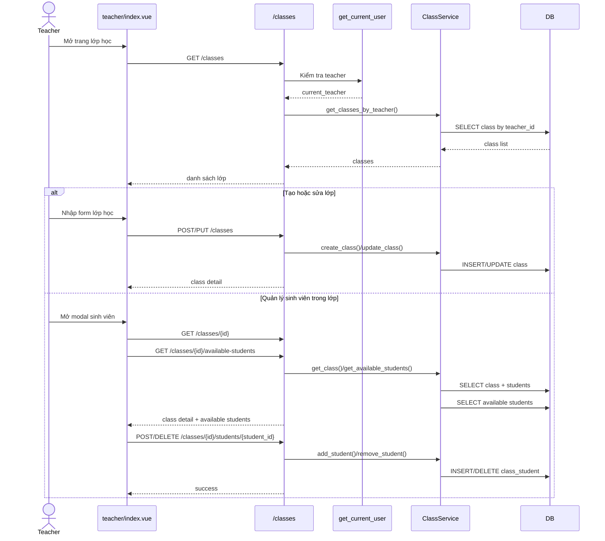

### SD-04: Teacher quản lý ngân hàng câu hỏi
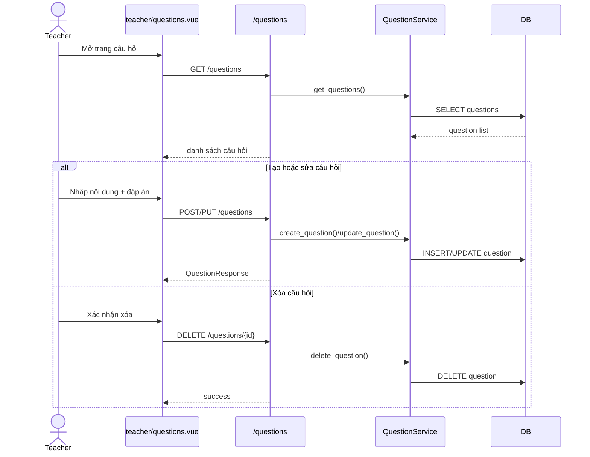

### SD-05: Teacher quản lý đề thi
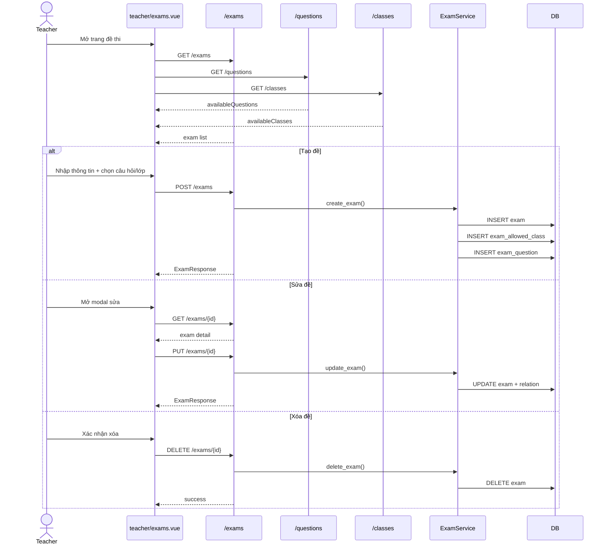

### SD-06: Teacher xem thống kê kết quả và review bài làm
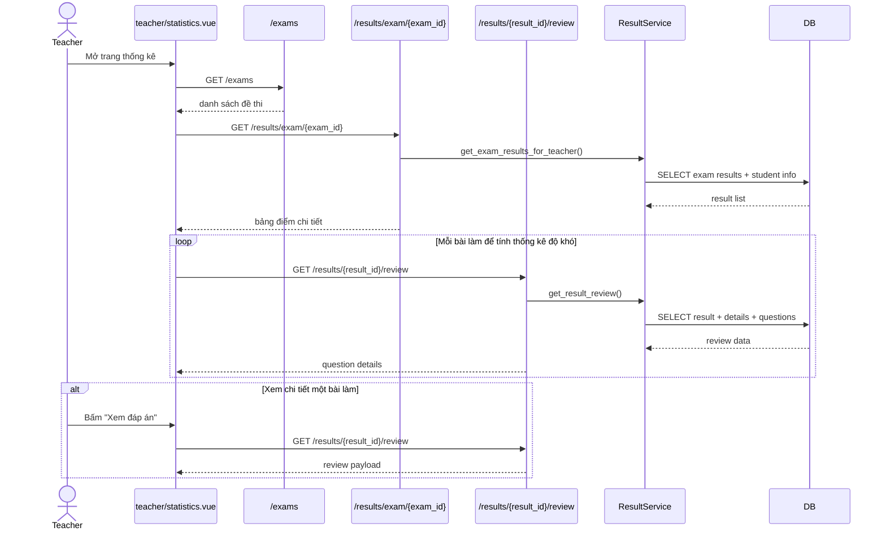

### SD-07: Student xem danh sách bài thi và kiểm tra mật khẩu
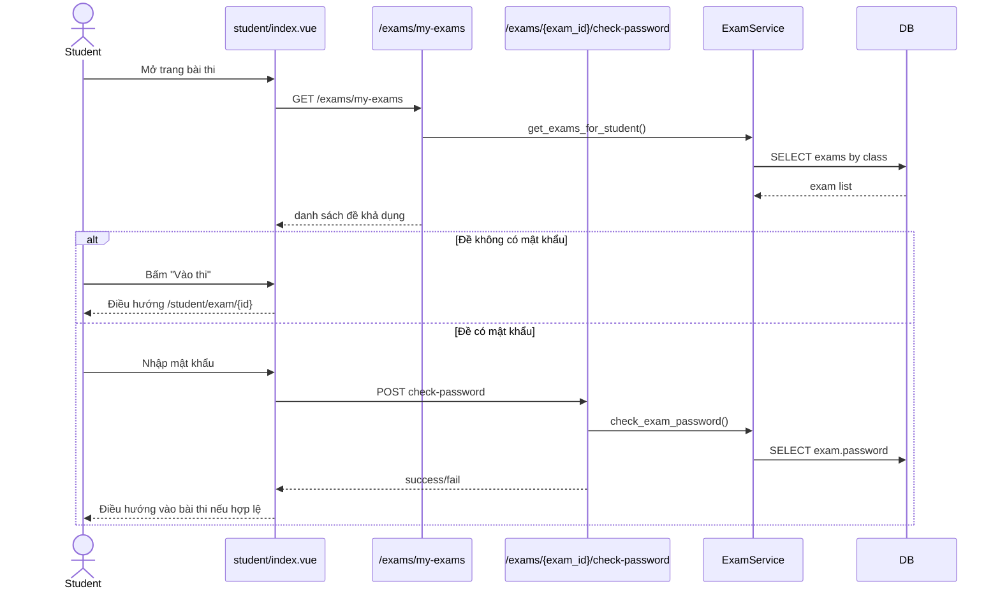

### SD-08: Student làm bài thi, chống gian lận và nộp bài
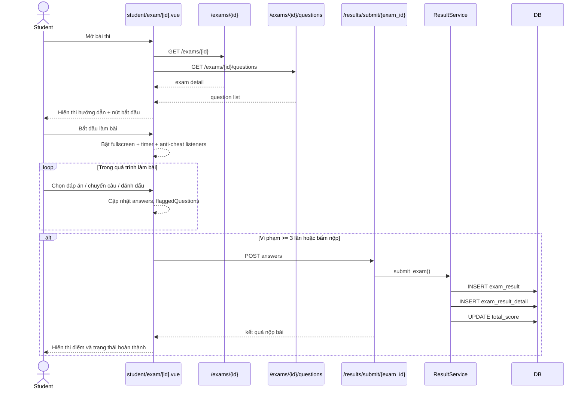

### SD-09: Student xem lịch sử thi và review bài làm
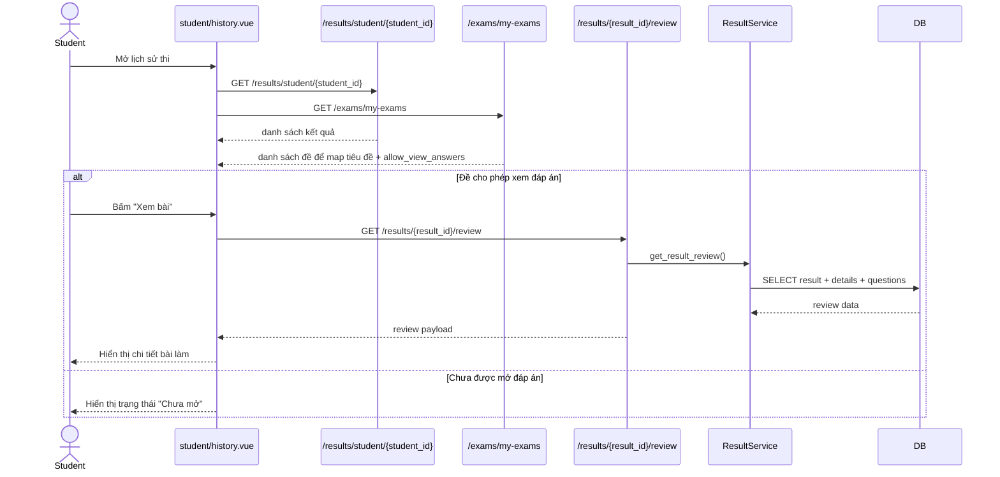

## 8) Ma trận chức năng theo vai trò

| Chức năng | Admin | Teacher | Student |
|---|---|---|---|
| Đăng nhập | X | X | X |
| Health check | X | X | X |
| Quản lý users | X |  |  |
| Quản lý lớp học |  | X |  |
| Quản lý học sinh trong lớp |  | X |  |
| Quản lý câu hỏi |  | X |  |
| Tạo/sửa/xóa đề |  | X |  |
| Xem đề của mình |  | X | X |
| Kiểm tra mật khẩu đề |  | X | X |
| Nộp bài thi |  |  | X |
| Xem lịch sử kết quả |  | X | X |
| Review bài làm |  | X | X |
| Sửa điểm/xóa kết quả |  | X |  |

## 9) Danh mục endpoint (để đối chiếu nhanh)

- `POST /login`
- `GET /`
- `POST /users`
- `GET /users`
- `GET /users/{user_id}`
- `PUT /users/{user_id}`
- `DELETE /users/{user_id}`
- `GET /classes`
- `POST /classes`
- `GET /classes/{class_id}`
- `PUT /classes/{class_id}`
- `DELETE /classes/{class_id}`
- `GET /classes/{class_id}/available-students`
- `POST /classes/{class_id}/students/{student_id}`
- `DELETE /classes/{class_id}/students/{student_id}`
- `POST /questions`
- `GET /questions`
- `GET /questions/{question_id}`
- `PUT /questions/{question_id}`
- `DELETE /questions/{question_id}`
- `GET /exams`
- `POST /exams`
- `GET /exams/my-exams`
- `GET /exams/{exam_id}`
- `PUT /exams/{exam_id}`
- `DELETE /exams/{exam_id}`
- `GET /exams/{exam_id}/questions`
- `POST /exams/{exam_id}/check-password`
- `POST /results/submit/{exam_id}`
- `GET /results/{result_id}`
- `GET /results/student/{student_id}`
- `GET /results/exam/{exam_id}`
- `GET /results/{result_id}/review`
- `PUT /results/{result_id}/score`
- `DELETE /results/{result_id}`
