# UML - Hệ thống Thi Trắc Nghiệm

## 0. Phạm vi

Tài liệu này mô tả UML/DFD cho dự án thi trắc nghiệm hiện tại, dựa trên backend FastAPI, frontend Nuxt/Vue và file UML gốc của nhóm.

Kiến trúc chính:

- Frontend: Nuxt 4/Vue 3.
- Backend: một ứng dụng FastAPI dạng monolith.
- Database: MySQL.
- Vai trò: `Admin`, `Teacher`, `Student`.
- Các nhóm API chính: `/login`, `/admins`, `/teachers`, `/students`, `/account-requests`, `/classes`, `/questions`, `/exams`, `/results`.

Các bảng chính đang dùng:

```text
admin
teacher
student
account_request
class
class_student
question_topic
question
exam
exam_question
exam_allowed_class
exam_session
exam_violation
exam_result
exam_result_detail
```

## 1. Use Case Chính

### UC-01: Đăng nhập hệ thống

| Mục | Nội dung |
|---|---|
| Actor | Admin, Teacher, Student |
| API | `POST /login` |
| Mô tả | Người dùng nhập username/password, hệ thống xác thực tài khoản và trả JWT kèm `user_id`, `role`, `full_name`. |
| Kết quả | Người dùng được điều hướng đến trang tương ứng với vai trò. |

### UC-02: Admin quản lý tài khoản

| Mục | Nội dung |
|---|---|
| Actor | Admin |
| API | `/admins`, `/teachers`, `/students`, `/account-requests` |
| Mô tả | Admin xem, tạo, sửa, xóa tài khoản; duyệt hoặc từ chối yêu cầu tạo tài khoản. |
| Bảng liên quan | `admin`, `teacher`, `student`, `account_request` |

### UC-03: Teacher quản lý lớp học

| Mục | Nội dung |
|---|---|
| Actor | Teacher |
| API | `/classes` |
| Mô tả | Teacher tạo/sửa/xóa lớp, xem chi tiết lớp, thêm/xóa sinh viên khỏi lớp. |
| Bảng liên quan | `class`, `class_student`, `student` |

### UC-04: Teacher quản lý ngân hàng câu hỏi

| Mục | Nội dung |
|---|---|
| Actor | Teacher |
| API | `/questions`, `/questions/topics`, `/questions/import/csv`, `/questions/random-selection`, `/questions/generate-suggestions` |
| Mô tả | Teacher tạo/sửa/xóa câu hỏi, quản lý chủ đề, import CSV, chọn câu hỏi ngẫu nhiên và sinh gợi ý câu hỏi. |
| Bảng liên quan | `question_topic`, `question` |

### UC-05: Teacher quản lý đề thi

| Mục | Nội dung |
|---|---|
| Actor | Teacher |
| API | `/exams` |
| Mô tả | Teacher tạo/sửa/xóa đề, chọn câu hỏi, gán lớp, đặt thời gian, mật khẩu, số lần làm, cấu hình xáo trộn và publish đề. |
| Bảng liên quan | `exam`, `exam_question`, `exam_allowed_class` |

### UC-06: Student xem đề thi và kiểm tra mật khẩu

| Mục | Nội dung |
|---|---|
| Actor | Student |
| API | `GET /exams/my-exams`, `POST /exams/{exam_id}/check-password` |
| Mô tả | Student xem các đề được gán theo lớp và nhập mật khẩu nếu đề có yêu cầu. |
| Bảng liên quan | `exam`, `exam_allowed_class`, `class_student` |

### UC-07: Student làm bài và nộp bài

| Mục | Nội dung |
|---|---|
| Actor | Student |
| API | `GET /exams/{exam_id}`, `GET /exams/{exam_id}/questions`, `POST /exams/{exam_id}/start`, `PUT /exams/{exam_id}/autosave`, `POST /exams/{exam_id}/violations`, `POST /results/submit/{exam_id}` |
| Mô tả | Student mở đề, bắt đầu phiên thi, làm bài, hệ thống autosave, ghi nhận vi phạm và nộp bài. |
| Bảng liên quan | `exam_session`, `exam_violation`, `exam_result`, `exam_result_detail` |

### UC-08: Student xem lịch sử, phân tích và review bài làm

| Mục | Nội dung |
|---|---|
| Actor | Student |
| API | `/results/student/{student_id}`, `/results/student/{student_id}/analytics`, `/results/{result_id}/review` |
| Mô tả | Student xem lịch sử thi, thống kê cá nhân theo chủ đề/mức độ và review bài nếu đề cho phép xem đáp án. |
| Bảng liên quan | `exam_result`, `exam_result_detail`, `question`, `question_topic` |

### UC-09: Teacher xem thống kê và cập nhật điểm

| Mục | Nội dung |
|---|---|
| Actor | Teacher |
| API | `/results/exam/{exam_id}`, `/results/exam/{exam_id}/question-analytics`, `/results/{result_id}/review`, `/results/{result_id}/score` |
| Mô tả | Teacher xem kết quả theo đề, phân tích từng câu, review bài làm và cập nhật điểm thủ công khi cần. |
| Bảng liên quan | `exam_result`, `exam_result_detail`, `question` |

## 2. Use Case Tổng Quan

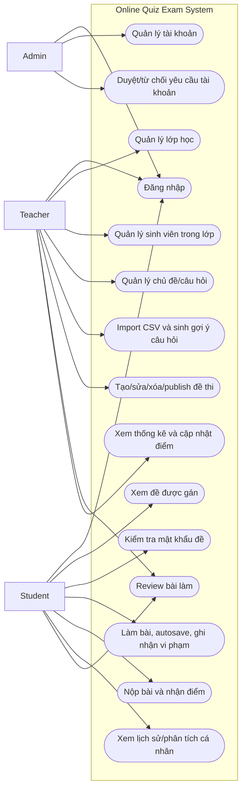
```mermaid
flowchart LR
  Admin[Admin]
  Teacher[Teacher]
  Student[Student]

  subgraph System[Online Quiz Exam System]
    UC1([Đăng nhập])
    UC2([Quản lý tài khoản])
    UC3([Duyệt/từ chối yêu cầu tài khoản])
    UC4([Quản lý lớp học])
    UC5([Quản lý sinh viên trong lớp])
    UC6([Quản lý chủ đề/câu hỏi])
    UC7([Import CSV và sinh gợi ý câu hỏi])
    UC8([Tạo/sửa/xóa/publish đề thi])
    UC9([Xem đề được gán])
    UC10([Kiểm tra mật khẩu đề])
    UC11([Làm bài, autosave, ghi nhận vi phạm])
    UC12([Nộp bài và nhận điểm])
    UC13([Xem lịch sử/phân tích cá nhân])
    UC14([Review bài làm])
    UC15([Xem thống kê và cập nhật điểm])
  end

  Admin --> UC1
  Admin --> UC2
  Admin --> UC3

  Teacher --> UC1
  Teacher --> UC4
  Teacher --> UC5
  Teacher --> UC6
  Teacher --> UC7
  Teacher --> UC8
  Teacher --> UC14
  Teacher --> UC15

  Student --> UC1
  Student --> UC9
  Student --> UC10
  Student --> UC11
  Student --> UC12
  Student --> UC13
  Student --> UC14
```

## 3. DFD Mức Ngữ Cảnh

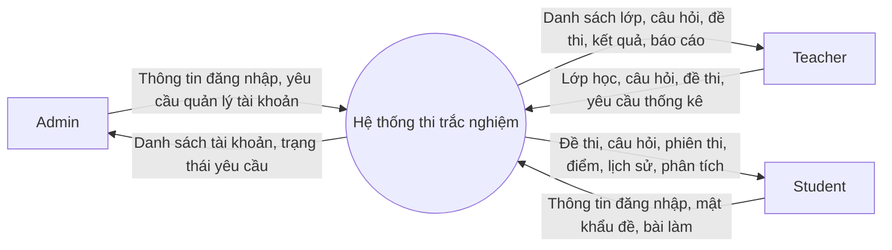
```mermaid
flowchart LR
  Admin[Admin]
  Teacher[Teacher]
  Student[Student]
  System((Hệ thống thi trắc nghiệm))

  Admin -->|Thông tin đăng nhập, yêu cầu quản lý tài khoản| System
  System -->|Danh sách tài khoản, trạng thái yêu cầu| Admin

  Teacher -->|Lớp học, câu hỏi, đề thi, yêu cầu thống kê| System
  System -->|Danh sách lớp, câu hỏi, đề thi, kết quả, báo cáo| Teacher

  Student -->|Thông tin đăng nhập, mật khẩu đề, bài làm| System
  System -->|Đề thi, câu hỏi, phiên thi, điểm, lịch sử, phân tích| Student
```

## 4. DFD Mức 0

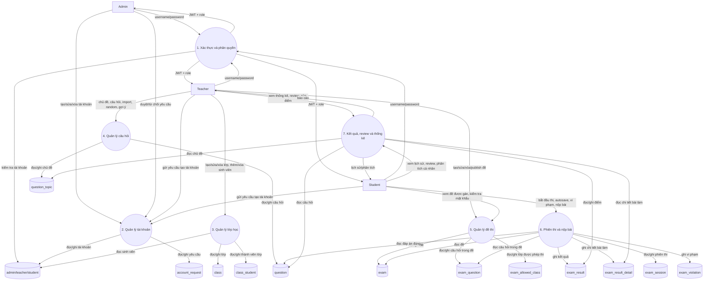
```mermaid
flowchart TB
  Admin[Admin]
  Teacher[Teacher]
  Student[Student]

  P1((1. Xác thực và phân quyền))
  P2((2. Quản lý tài khoản))
  P3((3. Quản lý lớp học))
  P4((4. Quản lý câu hỏi))
  P5((5. Quản lý đề thi))
  P6((6. Phiên thi và nộp bài))
  P7((7. Kết quả, review và thống kê))

  D1[(admin/teacher/student)]
  D2[(account_request)]
  D3[(class)]
  D4[(class_student)]
  D5[(question_topic)]
  D6[(question)]
  D7[(exam)]
  D8[(exam_question)]
  D9[(exam_allowed_class)]
  D10[(exam_session)]
  D11[(exam_violation)]
  D12[(exam_result)]
  D13[(exam_result_detail)]

  Admin -->|username/password| P1
  Teacher -->|username/password| P1
  Student -->|username/password| P1
  P1 -->|kiểm tra tài khoản| D1
  P1 -->|JWT + role| Admin
  P1 -->|JWT + role| Teacher
  P1 -->|JWT + role| Student

  Admin -->|tạo/sửa/xóa tài khoản| P2
  Admin -->|duyệt/từ chối yêu cầu| P2
  Teacher -->|gửi yêu cầu tạo tài khoản| P2
  Student -->|gửi yêu cầu tạo tài khoản| P2
  P2 -->|đọc/ghi tài khoản| D1
  P2 -->|đọc/ghi yêu cầu| D2

  Teacher -->|tạo/sửa/xóa lớp, thêm/xóa sinh viên| P3
  P3 -->|đọc/ghi lớp| D3
  P3 -->|đọc/ghi thành viên lớp| D4
  P3 -->|đọc sinh viên| D1

  Teacher -->|chủ đề, câu hỏi, import, random, gợi ý| P4
  P4 -->|đọc/ghi chủ đề| D5
  P4 -->|đọc/ghi câu hỏi| D6

  Teacher -->|tạo/sửa/xóa/publish đề| P5
  Student -->|xem đề được gán, kiểm tra mật khẩu| P5
  P5 -->|đọc/ghi đề| D7
  P5 -->|đọc/ghi câu hỏi trong đề| D8
  P5 -->|đọc/ghi lớp được phép thi| D9

  Student -->|bắt đầu thi, autosave, vi phạm, nộp bài| P6
  P6 -->|đọc đề| D7
  P6 -->|đọc câu hỏi trong đề| D8
  P6 -->|đọc đáp án đúng| D6
  P6 -->|đọc/ghi phiên thi| D10
  P6 -->|ghi vi phạm| D11
  P6 -->|ghi kết quả| D12
  P6 -->|ghi chi tiết bài làm| D13

  Teacher -->|xem thống kê, review, sửa điểm| P7
  Student -->|xem lịch sử, review, phân tích cá nhân| P7
  P7 -->|đọc/ghi điểm| D12
  P7 -->|đọc chi tiết bài làm| D13
  P7 -->|đọc câu hỏi| D6
  P7 -->|đọc chủ đề| D5
  P7 -->|báo cáo| Teacher
  P7 -->|lịch sử/phân tích| Student
```

## 5. Class Diagram Theo Database Hiện Tại

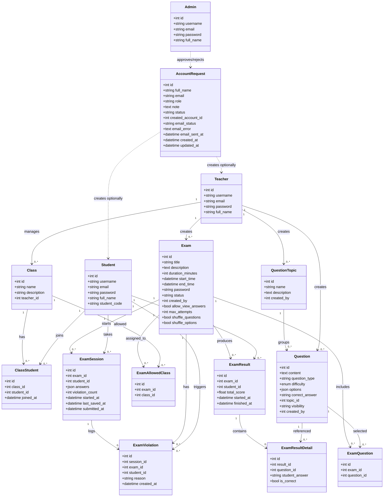
```mermaid
classDiagram
class Admin {
  +int id
  +string username
  +string email
  +string password
  +string full_name
}

class Teacher {
  +int id
  +string username
  +string email
  +string password
  +string full_name
}

class Student {
  +int id
  +string username
  +string email
  +string password
  +string full_name
  +string student_code
}

class AccountRequest {
  +int id
  +string full_name
  +string email
  +string role
  +text note
  +string status
  +int created_account_id
  +string email_status
  +text email_error
  +datetime email_sent_at
  +datetime created_at
  +datetime updated_at
}

class Class {
  +int id
  +string name
  +string description
  +int teacher_id
}

class ClassStudent {
  +int id
  +int class_id
  +int student_id
  +datetime joined_at
}

class QuestionTopic {
  +int id
  +string name
  +text description
  +int created_by
}

class Question {
  +int id
  +text content
  +string question_type
  +enum difficulty
  +json options
  +string correct_answer
  +int topic_id
  +string visibility
  +int created_by
}

class Exam {
  +int id
  +string title
  +text description
  +int duration_minutes
  +datetime start_time
  +datetime end_time
  +string password
  +string status
  +int created_by
  +bool allow_view_answers
  +int max_attempts
  +bool shuffle_questions
  +bool shuffle_options
}

class ExamQuestion {
  +int id
  +int exam_id
  +int question_id
}

class ExamAllowedClass {
  +int id
  +int exam_id
  +int class_id
}

class ExamSession {
  +int id
  +int exam_id
  +int student_id
  +json answers
  +int violation_count
  +datetime started_at
  +datetime last_saved_at
  +datetime submitted_at
}

class ExamViolation {
  +int id
  +int session_id
  +int exam_id
  +int student_id
  +string reason
  +datetime created_at
}

class ExamResult {
  +int id
  +int exam_id
  +int student_id
  +float total_score
  +datetime started_at
  +datetime finished_at
}

class ExamResultDetail {
  +int id
  +int result_id
  +int question_id
  +string student_answer
  +bool is_correct
}

Teacher "1" --> "0..*" Class : manages
Class "1" --> "0..*" ClassStudent : has
Student "1" --> "0..*" ClassStudent : joins

Teacher "1" --> "0..*" QuestionTopic : creates
QuestionTopic "1" --> "0..*" Question : groups
Teacher "1" --> "0..*" Question : creates

Teacher "1" --> "0..*" Exam : creates
Exam "1" --> "0..*" ExamQuestion : includes
Question "1" --> "0..*" ExamQuestion : selected
Exam "1" --> "0..*" ExamAllowedClass : assigned_to
Class "1" --> "0..*" ExamAllowedClass : allowed

Exam "1" --> "0..*" ExamSession : starts
Student "1" --> "0..*" ExamSession : takes
ExamSession "1" --> "0..*" ExamViolation : logs
Exam "1" --> "0..*" ExamViolation : has
Student "1" --> "0..*" ExamViolation : triggers

Exam "1" --> "0..*" ExamResult : produces
Student "1" --> "0..*" ExamResult : receives
ExamResult "1" --> "0..*" ExamResultDetail : contains
Question "1" --> "0..*" ExamResultDetail : referenced

Admin ..> AccountRequest : approves/rejects
AccountRequest ..> Teacher : creates optionally
AccountRequest ..> Student : creates optionally
```

Ghi chú: `account_request.created_account_id` không khai báo khóa ngoại cố định vì tài khoản được tạo có thể là `teacher` hoặc `student`.

## 6. Class Diagram Nghiệp Vụ

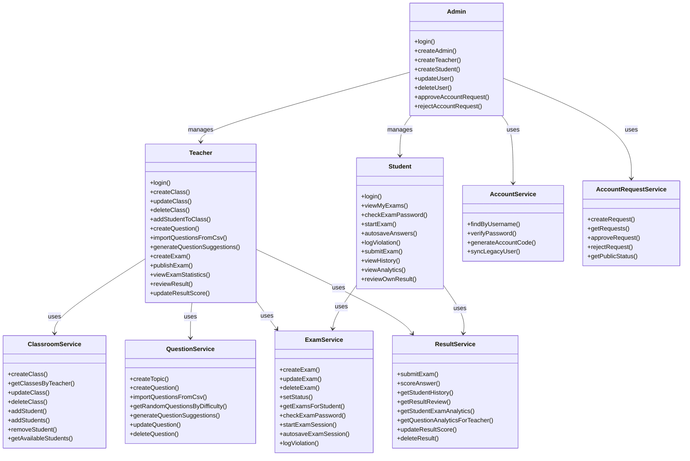
```mermaid
classDiagram
class Admin {
  +login()
  +createAdmin()
  +createTeacher()
  +createStudent()
  +updateUser()
  +deleteUser()
  +approveAccountRequest()
  +rejectAccountRequest()
}

class Teacher {
  +login()
  +createClass()
  +updateClass()
  +deleteClass()
  +addStudentToClass()
  +createQuestion()
  +importQuestionsFromCsv()
  +generateQuestionSuggestions()
  +createExam()
  +publishExam()
  +viewExamStatistics()
  +reviewResult()
  +updateResultScore()
}

class Student {
  +login()
  +viewMyExams()
  +checkExamPassword()
  +startExam()
  +autosaveAnswers()
  +logViolation()
  +submitExam()
  +viewHistory()
  +viewAnalytics()
  +reviewOwnResult()
}

class AccountService {
  +findByUsername()
  +verifyPassword()
  +generateAccountCode()
  +syncLegacyUser()
}

class AccountRequestService {
  +createRequest()
  +getRequests()
  +approveRequest()
  +rejectRequest()
  +getPublicStatus()
}

class ClassroomService {
  +createClass()
  +getClassesByTeacher()
  +updateClass()
  +deleteClass()
  +addStudent()
  +addStudents()
  +removeStudent()
  +getAvailableStudents()
}

class ExamService {
  +createExam()
  +updateExam()
  +deleteExam()
  +setStatus()
  +getExamsForStudent()
  +checkExamPassword()
  +startExamSession()
  +autosaveExamSession()
  +logViolation()
}

class QuestionService {
  +createTopic()
  +createQuestion()
  +importQuestionsFromCsv()
  +getRandomQuestionsByDifficulty()
  +generateQuestionSuggestions()
  +updateQuestion()
  +deleteQuestion()
}

class ResultService {
  +submitExam()
  +scoreAnswer()
  +getStudentHistory()
  +getResultReview()
  +getStudentExamAnalytics()
  +getQuestionAnalyticsForTeacher()
  +updateResultScore()
  +deleteResult()
}

Admin --> AccountService : uses
Admin --> AccountRequestService : uses
Admin --> Teacher : manages
Admin --> Student : manages
Teacher --> ClassroomService : uses
Teacher --> QuestionService : uses
Teacher --> ExamService : uses
Teacher --> ResultService : uses
Student --> ExamService : uses
Student --> ResultService : uses
```

## 7. Sequence Diagrams

### SD-01: Đăng nhập và điều hướng theo vai trò

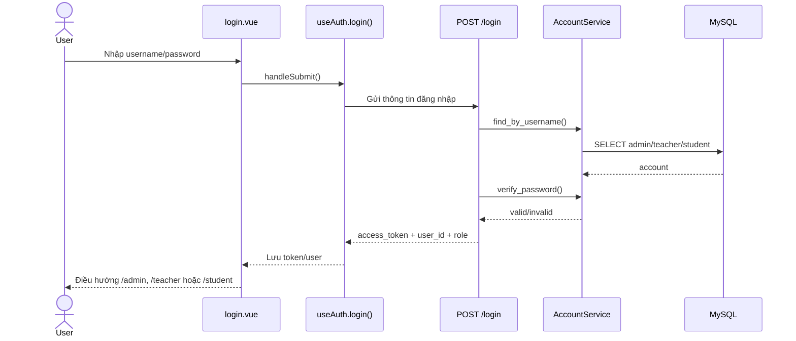
```mermaid
sequenceDiagram
actor User
participant LoginPage as login.vue
participant Auth as useAuth.login()
participant AuthAPI as POST /login
participant AccountService
participant DB as MySQL

User->>LoginPage: Nhập username/password
LoginPage->>Auth: handleSubmit()
Auth->>AuthAPI: Gửi thông tin đăng nhập
AuthAPI->>AccountService: find_by_username()
AccountService->>DB: SELECT admin/teacher/student
DB-->>AccountService: account
AuthAPI->>AccountService: verify_password()
AccountService-->>AuthAPI: valid/invalid
AuthAPI-->>Auth: access_token + user_id + role
Auth-->>LoginPage: Lưu token/user
LoginPage-->>User: Điều hướng /admin, /teacher hoặc /student
```

### SD-02: Người dùng gửi yêu cầu tạo tài khoản

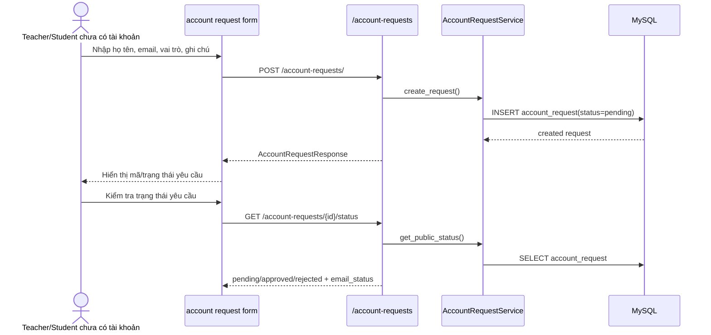
```mermaid
sequenceDiagram
actor Guest as Teacher/Student chưa có tài khoản
participant RequestPage as account request form
participant RequestAPI as /account-requests
participant AccountRequestService
participant DB as MySQL

Guest->>RequestPage: Nhập họ tên, email, vai trò, ghi chú
RequestPage->>RequestAPI: POST /account-requests/
RequestAPI->>AccountRequestService: create_request()
AccountRequestService->>DB: INSERT account_request(status=pending)
DB-->>AccountRequestService: created request
RequestAPI-->>RequestPage: AccountRequestResponse
RequestPage-->>Guest: Hiển thị mã/trạng thái yêu cầu

Guest->>RequestPage: Kiểm tra trạng thái yêu cầu
RequestPage->>RequestAPI: GET /account-requests/{id}/status
RequestAPI->>AccountRequestService: get_public_status()
AccountRequestService->>DB: SELECT account_request
RequestAPI-->>RequestPage: pending/approved/rejected + email_status
```

### SD-03: Admin quản lý tài khoản người dùng

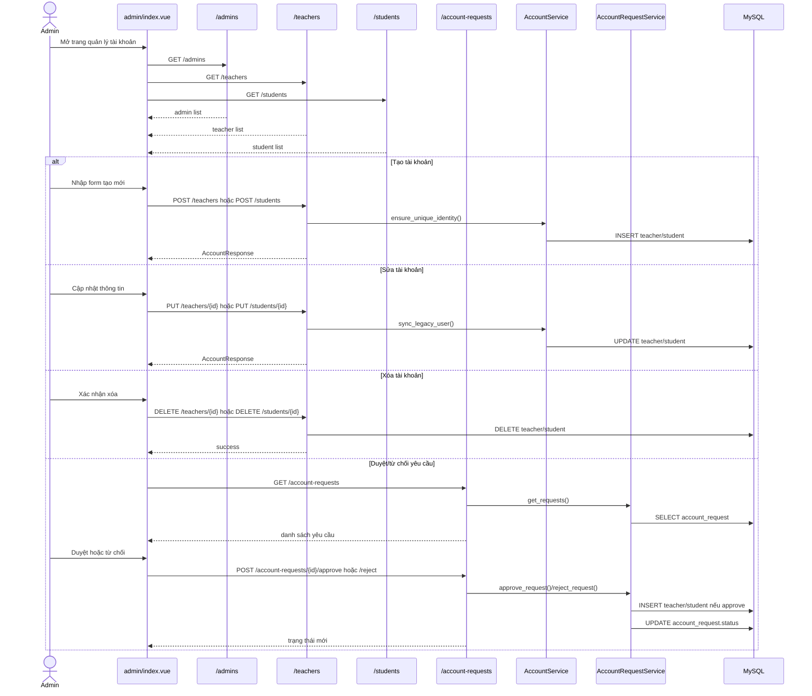
```mermaid
sequenceDiagram
actor Admin
participant AdminPage as admin/index.vue
participant AdminAPI as /admins
participant TeacherAPI as /teachers
participant StudentAPI as /students
participant RequestAPI as /account-requests
participant AccountService
participant AccountRequestService
participant DB as MySQL

Admin->>AdminPage: Mở trang quản lý tài khoản
AdminPage->>AdminAPI: GET /admins
AdminPage->>TeacherAPI: GET /teachers
AdminPage->>StudentAPI: GET /students
AdminAPI-->>AdminPage: admin list
TeacherAPI-->>AdminPage: teacher list
StudentAPI-->>AdminPage: student list

alt Tạo tài khoản
  Admin->>AdminPage: Nhập form tạo mới
  AdminPage->>TeacherAPI: POST /teachers hoặc POST /students
  TeacherAPI->>AccountService: ensure_unique_identity()
  AccountService->>DB: INSERT teacher/student
  TeacherAPI-->>AdminPage: AccountResponse
else Sửa tài khoản
  Admin->>AdminPage: Cập nhật thông tin
  AdminPage->>TeacherAPI: PUT /teachers/{id} hoặc PUT /students/{id}
  TeacherAPI->>AccountService: sync_legacy_user()
  AccountService->>DB: UPDATE teacher/student
  TeacherAPI-->>AdminPage: AccountResponse
else Xóa tài khoản
  Admin->>AdminPage: Xác nhận xóa
  AdminPage->>TeacherAPI: DELETE /teachers/{id} hoặc DELETE /students/{id}
  TeacherAPI->>DB: DELETE teacher/student
  TeacherAPI-->>AdminPage: success
else Duyệt/từ chối yêu cầu
  AdminPage->>RequestAPI: GET /account-requests
  RequestAPI->>AccountRequestService: get_requests()
  AccountRequestService->>DB: SELECT account_request
  RequestAPI-->>AdminPage: danh sách yêu cầu
  Admin->>AdminPage: Duyệt hoặc từ chối
  AdminPage->>RequestAPI: POST /account-requests/{id}/approve hoặc /reject
  RequestAPI->>AccountRequestService: approve_request()/reject_request()
  AccountRequestService->>DB: INSERT teacher/student nếu approve
  AccountRequestService->>DB: UPDATE account_request.status
  RequestAPI-->>AdminPage: trạng thái mới
end
```

### SD-04: Teacher quản lý lớp học và sinh viên trong lớp

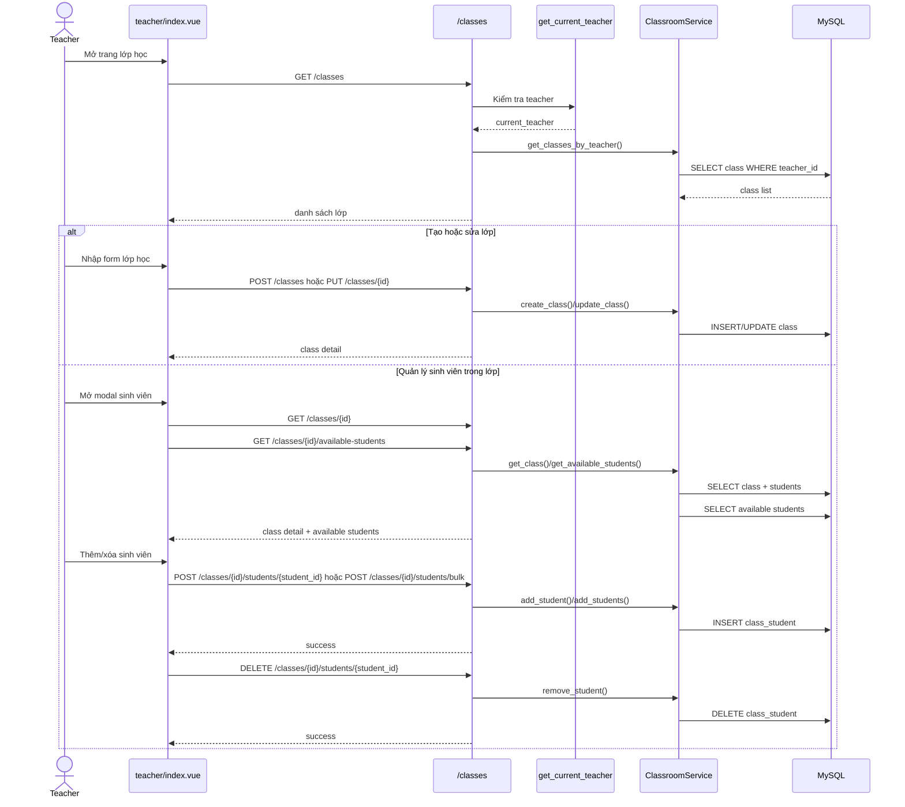
```mermaid
sequenceDiagram
actor Teacher
participant Page as teacher/index.vue
participant ClassAPI as /classes
participant Dep as get_current_teacher
participant ClassroomService
participant DB as MySQL

Teacher->>Page: Mở trang lớp học
Page->>ClassAPI: GET /classes
ClassAPI->>Dep: Kiểm tra teacher
Dep-->>ClassAPI: current_teacher
ClassAPI->>ClassroomService: get_classes_by_teacher()
ClassroomService->>DB: SELECT class WHERE teacher_id
DB-->>ClassroomService: class list
ClassAPI-->>Page: danh sách lớp

alt Tạo hoặc sửa lớp
  Teacher->>Page: Nhập form lớp học
  Page->>ClassAPI: POST /classes hoặc PUT /classes/{id}
  ClassAPI->>ClassroomService: create_class()/update_class()
  ClassroomService->>DB: INSERT/UPDATE class
  ClassAPI-->>Page: class detail
else Quản lý sinh viên trong lớp
  Teacher->>Page: Mở modal sinh viên
  Page->>ClassAPI: GET /classes/{id}
  Page->>ClassAPI: GET /classes/{id}/available-students
  ClassAPI->>ClassroomService: get_class()/get_available_students()
  ClassroomService->>DB: SELECT class + students
  ClassroomService->>DB: SELECT available students
  ClassAPI-->>Page: class detail + available students
  Teacher->>Page: Thêm/xóa sinh viên
  Page->>ClassAPI: POST /classes/{id}/students/{student_id} hoặc POST /classes/{id}/students/bulk
  ClassAPI->>ClassroomService: add_student()/add_students()
  ClassroomService->>DB: INSERT class_student
  ClassAPI-->>Page: success
  Page->>ClassAPI: DELETE /classes/{id}/students/{student_id}
  ClassAPI->>ClassroomService: remove_student()
  ClassroomService->>DB: DELETE class_student
  ClassAPI-->>Page: success
end
```

### SD-05: Teacher quản lý ngân hàng câu hỏi

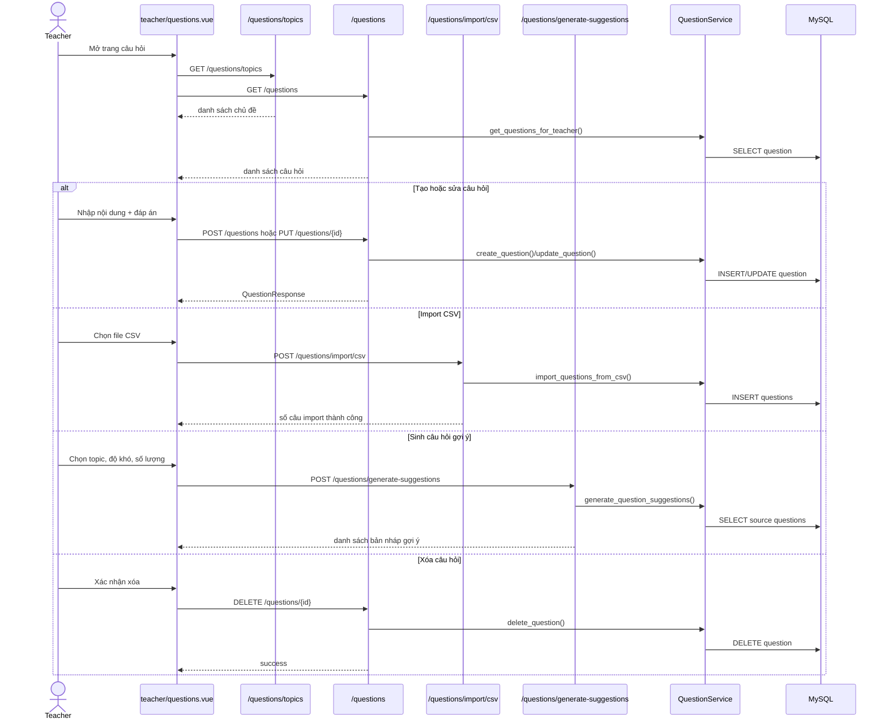
```mermaid
sequenceDiagram
actor Teacher
participant Page as teacher/questions.vue
participant TopicAPI as /questions/topics
participant QuestionAPI as /questions
participant ImportAPI as /questions/import/csv
participant SuggestAPI as /questions/generate-suggestions
participant QuestionService
participant DB as MySQL

Teacher->>Page: Mở trang câu hỏi
Page->>TopicAPI: GET /questions/topics
Page->>QuestionAPI: GET /questions
TopicAPI-->>Page: danh sách chủ đề
QuestionAPI->>QuestionService: get_questions_for_teacher()
QuestionService->>DB: SELECT question
QuestionAPI-->>Page: danh sách câu hỏi

alt Tạo hoặc sửa câu hỏi
  Teacher->>Page: Nhập nội dung + đáp án
  Page->>QuestionAPI: POST /questions hoặc PUT /questions/{id}
  QuestionAPI->>QuestionService: create_question()/update_question()
  QuestionService->>DB: INSERT/UPDATE question
  QuestionAPI-->>Page: QuestionResponse
else Import CSV
  Teacher->>Page: Chọn file CSV
  Page->>ImportAPI: POST /questions/import/csv
  ImportAPI->>QuestionService: import_questions_from_csv()
  QuestionService->>DB: INSERT questions
  ImportAPI-->>Page: số câu import thành công
else Sinh câu hỏi gợi ý
  Teacher->>Page: Chọn topic, độ khó, số lượng
  Page->>SuggestAPI: POST /questions/generate-suggestions
  SuggestAPI->>QuestionService: generate_question_suggestions()
  QuestionService->>DB: SELECT source questions
  SuggestAPI-->>Page: danh sách bản nháp gợi ý
else Xóa câu hỏi
  Teacher->>Page: Xác nhận xóa
  Page->>QuestionAPI: DELETE /questions/{id}
  QuestionAPI->>QuestionService: delete_question()
  QuestionService->>DB: DELETE question
  QuestionAPI-->>Page: success
end
```

### SD-06: Teacher import câu hỏi từ CSV

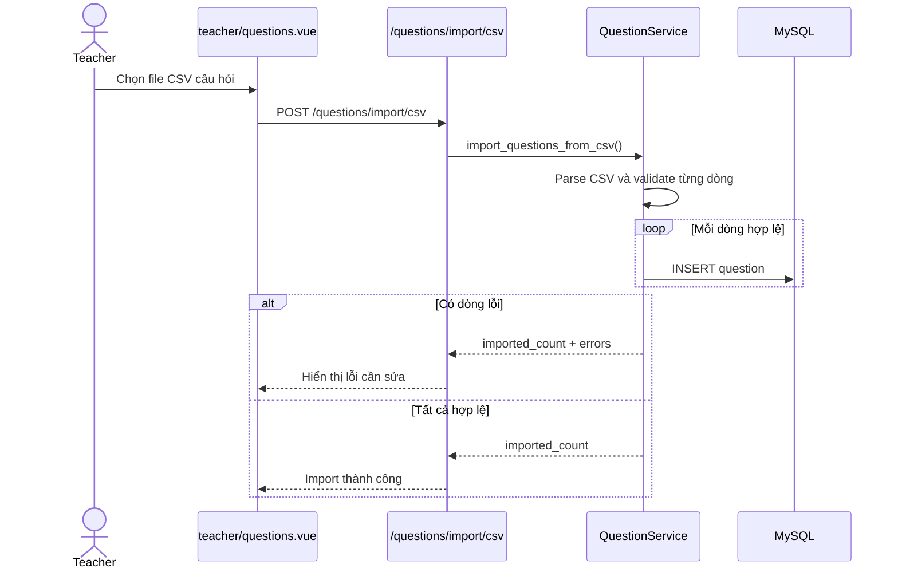
```mermaid
sequenceDiagram
actor Teacher
participant Page as teacher/questions.vue
participant ImportAPI as /questions/import/csv
participant QuestionService
participant DB as MySQL

Teacher->>Page: Chọn file CSV câu hỏi
Page->>ImportAPI: POST /questions/import/csv
ImportAPI->>QuestionService: import_questions_from_csv()
QuestionService->>QuestionService: Parse CSV và validate từng dòng

loop Mỗi dòng hợp lệ
  QuestionService->>DB: INSERT question
end

alt Có dòng lỗi
  QuestionService-->>ImportAPI: imported_count + errors
  ImportAPI-->>Page: Hiển thị lỗi cần sửa
else Tất cả hợp lệ
  QuestionService-->>ImportAPI: imported_count
  ImportAPI-->>Page: Import thành công
end
```

### SD-07: Teacher quản lý đề thi

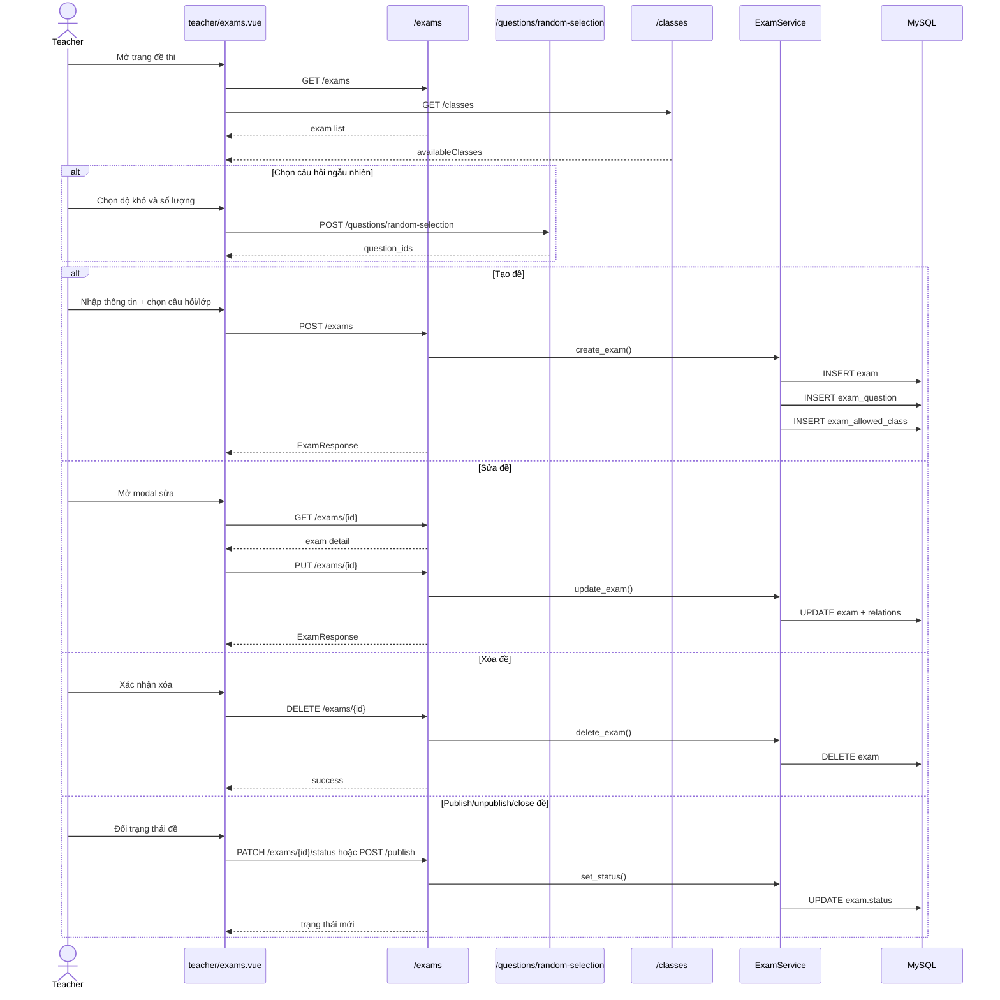
```mermaid
sequenceDiagram
actor Teacher
participant Page as teacher/exams.vue
participant ExamAPI as /exams
participant QuestionAPI as /questions/random-selection
participant ClassAPI as /classes
participant ExamService
participant DB as MySQL

Teacher->>Page: Mở trang đề thi
Page->>ExamAPI: GET /exams
Page->>ClassAPI: GET /classes
ExamAPI-->>Page: exam list
ClassAPI-->>Page: availableClasses

alt Chọn câu hỏi ngẫu nhiên
  Teacher->>Page: Chọn độ khó và số lượng
  Page->>QuestionAPI: POST /questions/random-selection
  QuestionAPI-->>Page: question_ids
end

alt Tạo đề
  Teacher->>Page: Nhập thông tin + chọn câu hỏi/lớp
  Page->>ExamAPI: POST /exams
  ExamAPI->>ExamService: create_exam()
  ExamService->>DB: INSERT exam
  ExamService->>DB: INSERT exam_question
  ExamService->>DB: INSERT exam_allowed_class
  ExamAPI-->>Page: ExamResponse
else Sửa đề
  Teacher->>Page: Mở modal sửa
  Page->>ExamAPI: GET /exams/{id}
  ExamAPI-->>Page: exam detail
  Page->>ExamAPI: PUT /exams/{id}
  ExamAPI->>ExamService: update_exam()
  ExamService->>DB: UPDATE exam + relations
  ExamAPI-->>Page: ExamResponse
else Xóa đề
  Teacher->>Page: Xác nhận xóa
  Page->>ExamAPI: DELETE /exams/{id}
  ExamAPI->>ExamService: delete_exam()
  ExamService->>DB: DELETE exam
  ExamAPI-->>Page: success
else Publish/unpublish/close đề
  Teacher->>Page: Đổi trạng thái đề
  Page->>ExamAPI: PATCH /exams/{id}/status hoặc POST /publish
  ExamAPI->>ExamService: set_status()
  ExamService->>DB: UPDATE exam.status
  ExamAPI-->>Page: trạng thái mới
end
```

### SD-08: Student xem danh sách bài thi và kiểm tra mật khẩu

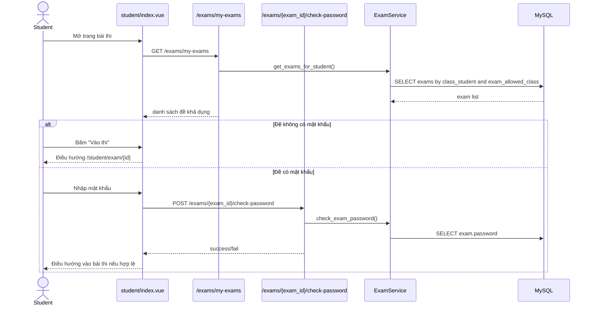
```mermaid
sequenceDiagram
actor Student
participant Home as student/index.vue
participant ExamListAPI as /exams/my-exams
participant PasswordAPI as /exams/{exam_id}/check-password
participant ExamService
participant DB as MySQL

Student->>Home: Mở trang bài thi
Home->>ExamListAPI: GET /exams/my-exams
ExamListAPI->>ExamService: get_exams_for_student()
ExamService->>DB: SELECT exams by class_student and exam_allowed_class
DB-->>ExamService: exam list
ExamListAPI-->>Home: danh sách đề khả dụng

alt Đề không có mật khẩu
  Student->>Home: Bấm "Vào thi"
  Home-->>Student: Điều hướng /student/exam/{id}
else Đề có mật khẩu
  Student->>Home: Nhập mật khẩu
  Home->>PasswordAPI: POST /exams/{exam_id}/check-password
  PasswordAPI->>ExamService: check_exam_password()
  ExamService->>DB: SELECT exam.password
  PasswordAPI-->>Home: success/fail
  Home-->>Student: Điều hướng vào bài thi nếu hợp lệ
end
```

### SD-09: Student làm bài thi, chống gian lận và nộp bài

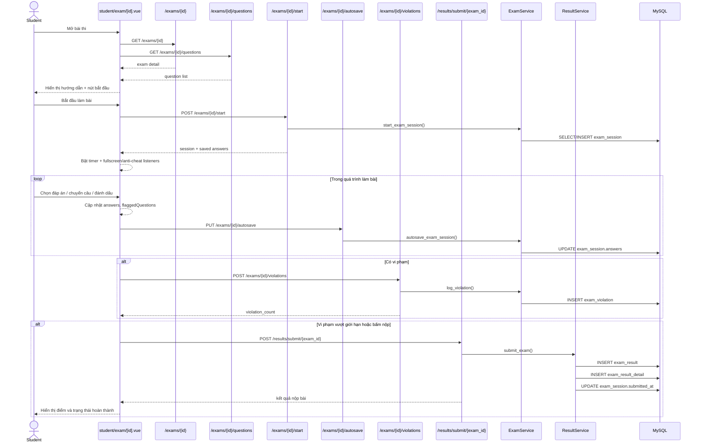
```mermaid
sequenceDiagram
actor Student
participant ExamPage as student/exam/[id].vue
participant ExamAPI as /exams/{id}
participant QuestionAPI as /exams/{id}/questions
participant StartAPI as /exams/{id}/start
participant AutosaveAPI as /exams/{id}/autosave
participant ViolationAPI as /exams/{id}/violations
participant ResultAPI as /results/submit/{exam_id}
participant ExamService
participant ResultService
participant DB as MySQL

Student->>ExamPage: Mở bài thi
ExamPage->>ExamAPI: GET /exams/{id}
ExamPage->>QuestionAPI: GET /exams/{id}/questions
ExamAPI-->>ExamPage: exam detail
QuestionAPI-->>ExamPage: question list
ExamPage-->>Student: Hiển thị hướng dẫn + nút bắt đầu

Student->>ExamPage: Bắt đầu làm bài
ExamPage->>StartAPI: POST /exams/{id}/start
StartAPI->>ExamService: start_exam_session()
ExamService->>DB: SELECT/INSERT exam_session
StartAPI-->>ExamPage: session + saved answers
ExamPage-->>ExamPage: Bật timer + fullscreen/anti-cheat listeners

loop Trong quá trình làm bài
  Student->>ExamPage: Chọn đáp án / chuyển câu / đánh dấu
  ExamPage-->>ExamPage: Cập nhật answers, flaggedQuestions
  ExamPage->>AutosaveAPI: PUT /exams/{id}/autosave
  AutosaveAPI->>ExamService: autosave_exam_session()
  ExamService->>DB: UPDATE exam_session.answers
end

alt Có vi phạm
  ExamPage->>ViolationAPI: POST /exams/{id}/violations
  ViolationAPI->>ExamService: log_violation()
  ExamService->>DB: INSERT exam_violation
  ViolationAPI-->>ExamPage: violation_count
end

alt Vi phạm vượt giới hạn hoặc bấm nộp
  ExamPage->>ResultAPI: POST /results/submit/{exam_id}
  ResultAPI->>ResultService: submit_exam()
  ResultService->>DB: INSERT exam_result
  ResultService->>DB: INSERT exam_result_detail
  ResultService->>DB: UPDATE exam_session.submitted_at
  ResultAPI-->>ExamPage: kết quả nộp bài
  ExamPage-->>Student: Hiển thị điểm và trạng thái hoàn thành
end
```

### SD-10: Student xem lịch sử thi và review bài làm

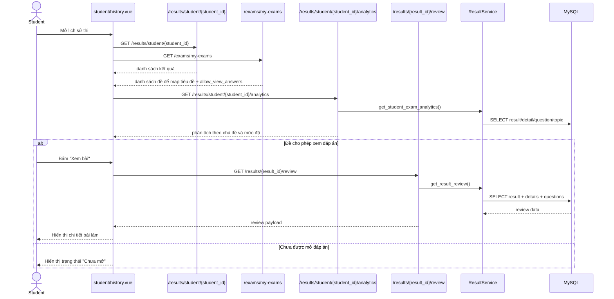
```mermaid
sequenceDiagram
actor Student
participant HistoryPage as student/history.vue
participant HistoryAPI as /results/student/{student_id}
participant ExamListAPI as /exams/my-exams
participant AnalyticsAPI as /results/student/{student_id}/analytics
participant ReviewAPI as /results/{result_id}/review
participant ResultService
participant DB as MySQL

Student->>HistoryPage: Mở lịch sử thi
HistoryPage->>HistoryAPI: GET /results/student/{student_id}
HistoryPage->>ExamListAPI: GET /exams/my-exams
HistoryAPI-->>HistoryPage: danh sách kết quả
ExamListAPI-->>HistoryPage: danh sách đề để map tiêu đề + allow_view_answers

HistoryPage->>AnalyticsAPI: GET /results/student/{student_id}/analytics
AnalyticsAPI->>ResultService: get_student_exam_analytics()
ResultService->>DB: SELECT result/detail/question/topic
AnalyticsAPI-->>HistoryPage: phân tích theo chủ đề và mức độ

alt Đề cho phép xem đáp án
  Student->>HistoryPage: Bấm "Xem bài"
  HistoryPage->>ReviewAPI: GET /results/{result_id}/review
  ReviewAPI->>ResultService: get_result_review()
  ResultService->>DB: SELECT result + details + questions
  DB-->>ResultService: review data
  ReviewAPI-->>HistoryPage: review payload
  HistoryPage-->>Student: Hiển thị chi tiết bài làm
else Chưa được mở đáp án
  HistoryPage-->>Student: Hiển thị trạng thái "Chưa mở"
end
```

### SD-11: Teacher xem thống kê kết quả và review bài làm

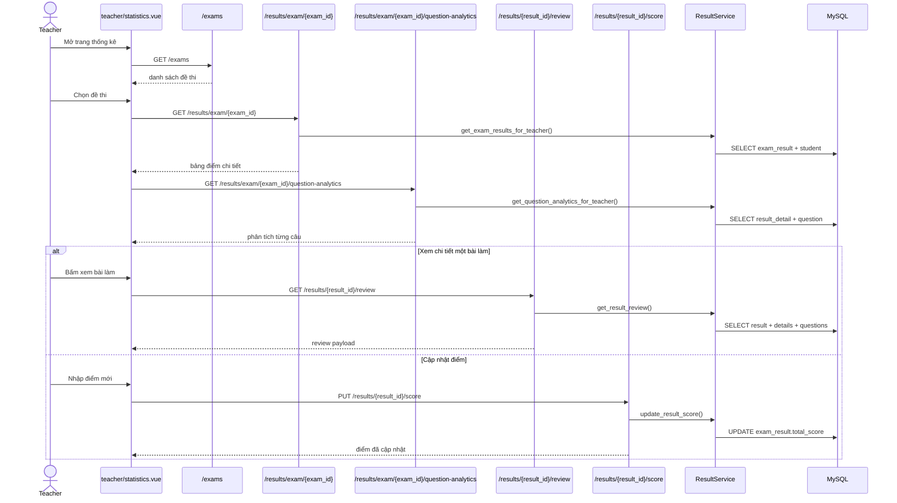
```mermaid
sequenceDiagram
actor Teacher
participant Page as teacher/statistics.vue
participant ExamAPI as /exams
participant ResultAPI as /results/exam/{exam_id}
participant AnalyticsAPI as /results/exam/{exam_id}/question-analytics
participant ReviewAPI as /results/{result_id}/review
participant ScoreAPI as /results/{result_id}/score
participant ResultService
participant DB as MySQL

Teacher->>Page: Mở trang thống kê
Page->>ExamAPI: GET /exams
ExamAPI-->>Page: danh sách đề thi
Teacher->>Page: Chọn đề thi
Page->>ResultAPI: GET /results/exam/{exam_id}
ResultAPI->>ResultService: get_exam_results_for_teacher()
ResultService->>DB: SELECT exam_result + student
ResultAPI-->>Page: bảng điểm chi tiết

Page->>AnalyticsAPI: GET /results/exam/{exam_id}/question-analytics
AnalyticsAPI->>ResultService: get_question_analytics_for_teacher()
ResultService->>DB: SELECT result_detail + question
AnalyticsAPI-->>Page: phân tích từng câu

alt Xem chi tiết một bài làm
  Teacher->>Page: Bấm xem bài làm
  Page->>ReviewAPI: GET /results/{result_id}/review
  ReviewAPI->>ResultService: get_result_review()
  ResultService->>DB: SELECT result + details + questions
  ReviewAPI-->>Page: review payload
else Cập nhật điểm
  Teacher->>Page: Nhập điểm mới
  Page->>ScoreAPI: PUT /results/{result_id}/score
  ScoreAPI->>ResultService: update_result_score()
  ResultService->>DB: UPDATE exam_result.total_score
  ScoreAPI-->>Page: điểm đã cập nhật
end
```

### SD-12: Teacher xem phiên thi và vi phạm của sinh viên

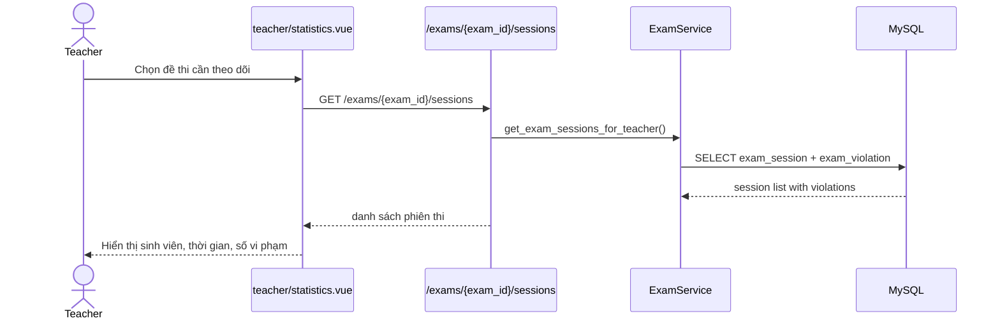
```mermaid
sequenceDiagram
actor Teacher
participant Page as teacher/statistics.vue
participant SessionAPI as /exams/{exam_id}/sessions
participant ExamService
participant DB as MySQL

Teacher->>Page: Chọn đề thi cần theo dõi
Page->>SessionAPI: GET /exams/{exam_id}/sessions
SessionAPI->>ExamService: get_exam_sessions_for_teacher()
ExamService->>DB: SELECT exam_session + exam_violation
DB-->>ExamService: session list with violations
SessionAPI-->>Page: danh sách phiên thi
Page-->>Teacher: Hiển thị sinh viên, thời gian, số vi phạm
```

## 8. Ma Trận Chức Năng Theo Vai Trò

| Chức năng | Admin | Teacher | Student |
|---|---:|---:|---:|
| Đăng nhập | X | X | X |
| Quản lý admin/teacher/student | X |  |  |
| Duyệt/từ chối yêu cầu tạo tài khoản | X |  |  |
| Gửi yêu cầu tạo tài khoản |  | X | X |
| Quản lý lớp học |  | X |  |
| Thêm/xóa sinh viên trong lớp |  | X |  |
| Quản lý chủ đề/câu hỏi |  | X |  |
| Import CSV câu hỏi |  | X |  |
| Chọn câu hỏi ngẫu nhiên theo độ khó |  | X |  |
| Sinh câu hỏi gợi ý |  | X |  |
| Tạo/sửa/xóa đề thi |  | X |  |
| Publish/unpublish/close đề thi |  | X |  |
| Xem đề được gán |  |  | X |
| Kiểm tra mật khẩu đề |  |  | X |
| Bắt đầu phiên thi |  |  | X |
| Autosave bài làm |  |  | X |
| Ghi nhận vi phạm khi làm bài |  |  | X |
| Nộp bài và nhận điểm |  |  | X |
| Xem lịch sử/phân tích cá nhân |  |  | X |
| Xem thống kê theo đề |  | X |  |
| Xem review bài làm |  | X | X |
| Cập nhật điểm thủ công |  | X |  |
| Xóa kết quả | X | X |  |

## 9. Danh Mục Endpoint Chính

### Auth

- `POST /login`
- `POST /debug-login`
- `GET /`
- `GET /health`

### Admin/User

- `GET /admins/`
- `POST /admins/`
- `GET /admins/{admin_id}`
- `PUT /admins/{admin_id}`
- `DELETE /admins/{admin_id}`
- `GET /teachers/`
- `POST /teachers/`
- `GET /teachers/{teacher_id}`
- `PUT /teachers/{teacher_id}`
- `DELETE /teachers/{teacher_id}`
- `GET /students/`
- `POST /students/`
- `GET /students/{student_id}`
- `PUT /students/{student_id}`
- `DELETE /students/{student_id}`
- `POST /account-requests/`
- `GET /account-requests/`
- `GET /account-requests/{request_id}/status`
- `POST /account-requests/{request_id}/approve`
- `POST /account-requests/{request_id}/reject`

### Classes

- `GET /classes/`
- `POST /classes/`
- `GET /classes/{class_id}`
- `PUT /classes/{class_id}`
- `DELETE /classes/{class_id}`
- `GET /classes/{class_id}/available-students`
- `POST /classes/{class_id}/students/{student_id}`
- `POST /classes/{class_id}/students/bulk`
- `DELETE /classes/{class_id}/students/{student_id}`

### Questions

- `GET /questions/topics/`
- `POST /questions/topics/`
- `GET /questions/`
- `POST /questions/`
- `GET /questions/{question_id}`
- `PUT /questions/{question_id}`
- `DELETE /questions/{question_id}`
- `POST /questions/import/csv`
- `POST /questions/random-selection`
- `POST /questions/generate-suggestions`

### Exams

- `GET /exams/`
- `POST /exams/`
- `GET /exams/my-exams`
- `GET /exams/{exam_id}`
- `PUT /exams/{exam_id}`
- `DELETE /exams/{exam_id}`
- `POST /exams/{exam_id}/publish`
- `POST /exams/{exam_id}/unpublish`
- `POST /exams/{exam_id}/close`
- `PATCH /exams/{exam_id}/status`
- `GET /exams/{exam_id}/questions`
- `POST /exams/{exam_id}/check-password`
- `POST /exams/{exam_id}/start`
- `PUT /exams/{exam_id}/autosave`
- `POST /exams/{exam_id}/violations`
- `GET /exams/{exam_id}/sessions`

### Results

- `POST /results/submit/{exam_id}`
- `GET /results/{result_id}`
- `GET /results/student/{student_id}`
- `GET /results/student/{student_id}/difficulty-stats`
- `GET /results/student/{student_id}/analytics`
- `GET /results/exam/{exam_id}`
- `GET /results/exam/{exam_id}/question-analytics`
- `GET /results/{result_id}/review`
- `PUT /results/{result_id}/score`
- `DELETE /results/{result_id}`
